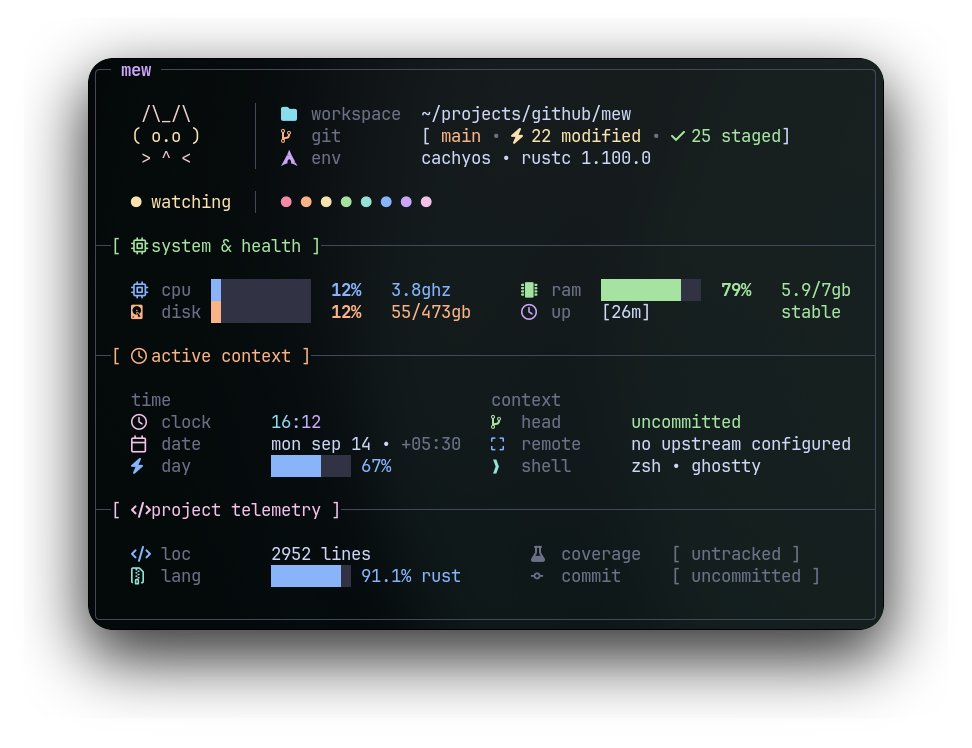
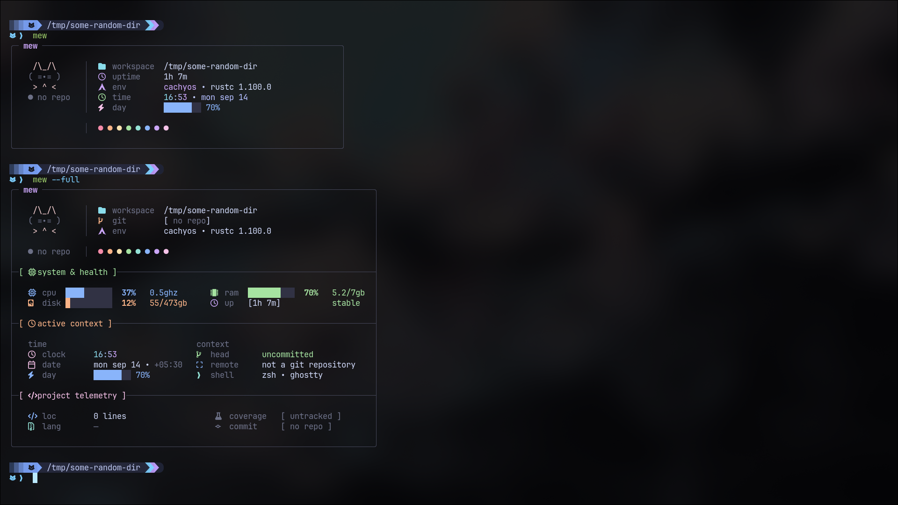

<div align="center">

# mew



**A fast terminal card for your project, Git state, and machine.**

[](https://github.com/programmersd21/mew/actions)
[](https://github.com/programmersd21/mew/releases)
[](https://crates.io/crates/mew-cli)
[](https://aur.archlinux.org/packages/mew-bin)
[](LICENSE)
[](https://github.com/programmersd21/mew)

</div>

## What it does

Run `mew` in a project and get the useful stuff at a glance:

- Git branch, dirty/staged/conflict/ahead state
- Project language and live toolchain version
- Lines of code and detected coverage
- CPU, frequency, memory, disk, and uptime
- Clock, date, timezone, and day progress

Inside Git worktrees, shell hooks can show it automatically.

Outside Git, mew becomes a small system readout.



It runs on demand and reads Git state only when invoked, so it stays fast with nothing running in the background.

## mew vs fastfetch

[Fastfetch](https://github.com/fastfetch-cli/fastfetch) is for **your machine**. mew is for **what you're working on**.

|                    | mew | fastfetch |
| ------------------ | --- | --------- |
| Git status         | ✓   | —         |
| Branch / conflicts | ✓   | —         |
| Toolchain          | ✓   | —         |
| Lines / coverage   | ✓   | —         |
| System info        | ✓   | ✓         |
| Shell Git hooks    | ✓   | —         |
| System-focused     | —   | ✓         |
| Custom modules     | —   | ✓         |

Use fastfetch for a system snapshot. Use mew when you want the project in front of you.

## Install

linux and macos:

```bash
curl -sSf https://raw.githubusercontent.com/programmersd21/mew/main/scripts/install.sh | bash
```

windows (powershell):

```powershell
irm https://raw.githubusercontent.com/programmersd21/mew/main/scripts/install.ps1 | iex
```

or download the matching asset from [releases](https://github.com/programmersd21/mew/releases) (`x86_64-unknown-linux-gnu`, `aarch64-apple-darwin`, `x86_64-pc-windows-msvc`).

or:

```sh
cargo install mew-cli
```

### Arch Linux (AUR)

```sh
paru -S mew-bin
# or
yay -S mew-bin
```

### Nix and Home Manager

Add mew as a flake input:

```nix
{
  inputs.mew.url = "github:programmersd21/mew";

  outputs = { nixpkgs, mew, ... }: {
    homeConfigurations."username" =
      home-manager.lib.homeManagerConfiguration {
        modules = [ mew.homeManagerModules.default ];
      };
  };
}
```

Then enable the module:

```nix
programs.mew.enable = true;
```

### Build from source

Requires Rust 1.85+.

```sh
cargo install --git https://github.com/programmersd21/mew mew-cli
```

## Usage

```sh
mew
mew --full
```

### Shell hooks

```sh
eval "$(mew hook bash)"
eval "$(mew hook zsh)"
mew hook fish | source
mew hook nu
```

```powershell
mew hook powershell | Out-String | Invoke-Expression
```

hooks only activate inside git worktrees.

## Configuration

Optional theme file at `~/.config/mew/theme.toml`.

```text
~/.config/mew/theme.toml        (linux and macos)
%APPDATA%\mew\theme.toml        (windows)
```

## Requirements

- Linux
- Nerd Font recommended
- Rust 1.85+ (build from source only)

* Linux, macOS, or Windows
* Nerd Font recommended
* Rust 1.95+ if building from source

[MIT](LICENSE)
